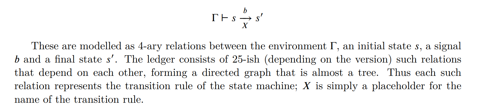

# formal-ledger-spec-4-plebs

Here you find some notes trying to translate the (formal-ledger-specifications pdf)(https://intersectmbo.github.io/formal-ledger-specifications/pdfs/cardano-ledger.pdf) in something that inferior imperative programmers like myself can understand.

# 1 Introduciton

## State treansitions

A state transition is with this scary thing in the pdf:



and later they present some even more scary agda:

```agda
record Computational (_⊢_⇀⦇_,X⦈_ : C → S → Sig → S → Type) : Type where
compute : C → S → Sig → Maybe S
≡-just⇔STS : compute Γ s b ≡ just s' ⇔ Γ ⊢ s ⇀⦇ b ,X⦈ s'
nothing⇒∀¬STS : compute Γ s b ≡ nothing → ∀ s' → ¬ Γ ⊢ s ⇀⦇ b ,X⦈ s
```

all this just to say that a ledger state transitin can be described as

```ts
function computeStateTransition(
    ctx: LedgerStateContext, // Γ in the scary formula
    initialState: LedgerState, // s
    signal: Transition // Also `Sig` (short for "Signal") or `b` in the fomula 
): LedgerState | undefined
{
    /* magic goes here */
}
```

even this translation, while not using strange symbols from dead languages, is pretty abstract.

In most cases the context (`ctx`) will be the protocol parameters the slot and maybe some other "global variable",

the `initialState` will be some subset of the ledger state (sometimes single utxos),

the `signal` will be a transaction (`Tx`).

# 2 Notation

here are defined some common operation (and strange symbols because normal function names are unholy)

## Sums and products

```ts
type Sum<A,B> =  A | B // A ⊎ B
```
```ts
type Product<A,B> = A & B // A × B
```

the `&` in the `Product` is not to be taken litterally, is just the closest concetpt.

as an example a `TxIn` (or colloquially an `UtxoRef`) is defined as
```
TxIn = TxId × Ix
```

which should be taken as

```ts
type UtxoRefStr = `${TxHash}#${OutIdx}`;
```

## addition on maps

```
∑[ x ← m ] f x 
```

`m` is the `map` parameter
`x` is a `value` from the map

**IMPORTANT NOTE**

> in this example we use numbers because the "addition" is already defined
> 
> however it can be "any type" and an "addition" should probably be specified

```ts
function addMap<T>( map: Map<any, T>, f: ( value: T ) => number ): number
{
    let sum = 0;
    for( const value of map.values() ) sum += f( value );
    return sum;
}
```


## Left biased union

joins two maps (`Map<A,B>`) giving precedence to the elements of the first map

```ts
function leftBiasedUnion<A,B>( preferred: Map<A,B>, other: Map<A,B> ): Map<A,B>
{
    const result = new Map<A,B>( preferred.entries() );
    for(const [ k, v ] of other )
    {
        if( !result.has( k ) ) result.set( k, v );
    }
    return result;
}
```

## addition union

joins two maps (`Map<A,B>`) adding values corresponding to the same key

```ts
function additionUnion<A,B>( preferred: Map<A,B>, other: Map<A,B> ): Map<A,B>
{
    const result = new Map<A,B>( preferred.entries() );
    for(const [ k, v ] of other )
    {
        if( result.has( k ) ) result.set( k, v + result.get( k ) );
        else result.set( k, v )
    }
    return result;
}
```

## mapping a partial function

we have a function `f` of type
```ts
type PartialFunc<A,B> = ( something: A ) => (B | undefined)
```

the `mapPartial`, defined as
```
{f x ∣ x ∈ S and f is defined at x}.
```
simply does
```ts
function mapPartial<A,B>( set: Set<A>, f: PartialFunc<A,B> ): Set<B>
{
    let tmp: B | undefined = undefined;
    const result = new Set<B>()
    for( const elem of set )
    {
        tmp = f( elem );
        if( tmp !== undefined ) result.add( elem )
    }
    return result;
}
```

# 3 crypto stuff

`SKey` => private key
`VKey` => public key
`Sig`  => signature
`Ser`  => payload (to sign)